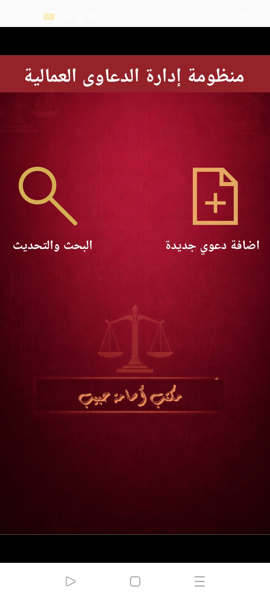
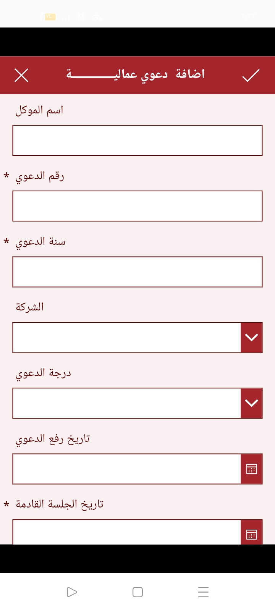
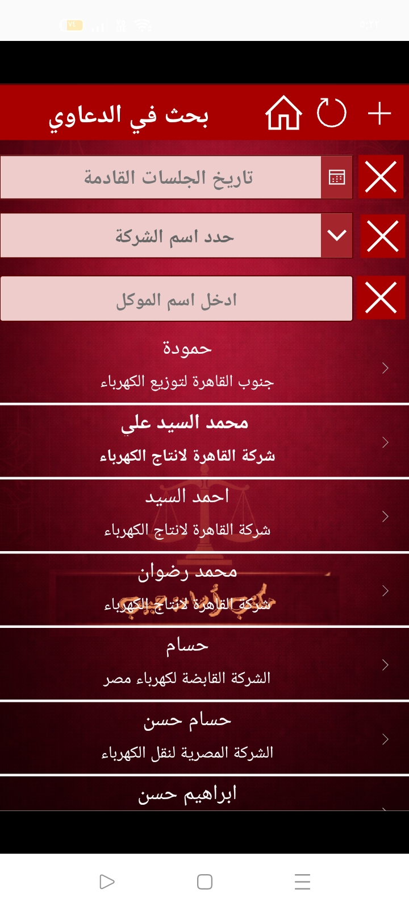
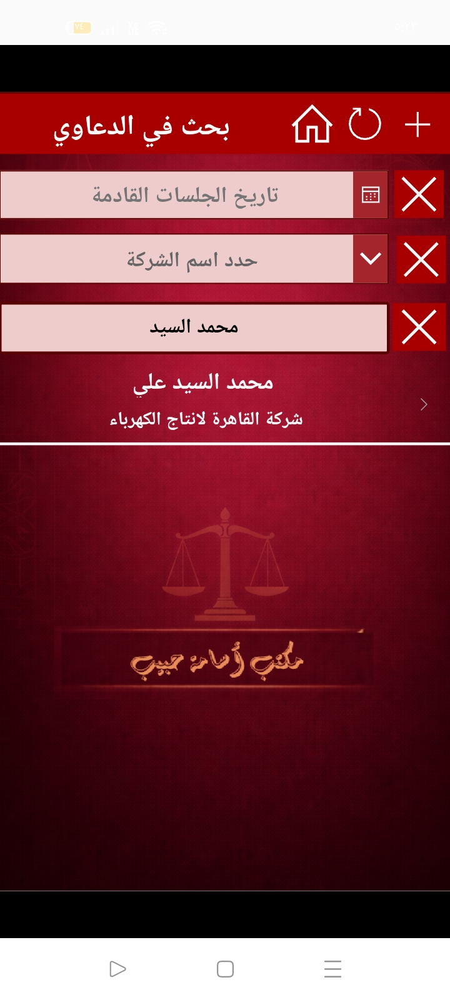
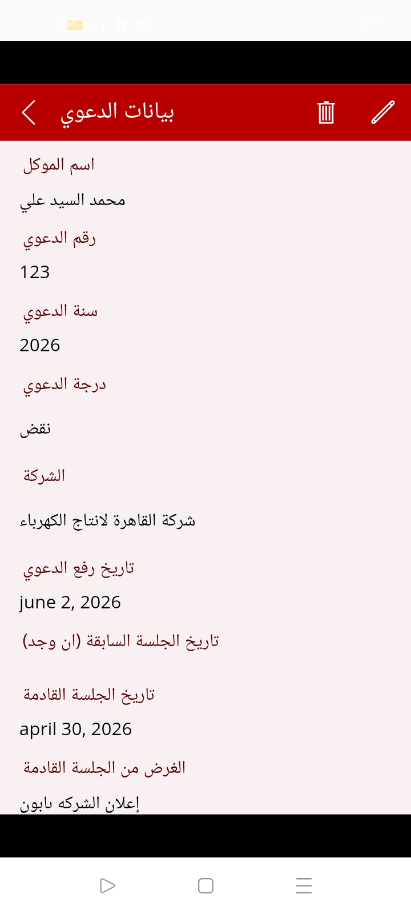

# ⚖️ Labor Lawsuit Management System
Project Overview
This project is a specialized Legal Case Management System designed for a law office to organize and track labor-related lawsuits. The system provides a streamlined digital workflow for managing client data, lawsuit details, and critical court dates, moving away from manual filing to an automated, searchable database.

## Objectives
Legal Record Digitization: Centralize all labor lawsuit information in a single, secure digital environment.

Case Tracking: Monitor the lifecycle of a lawsuit from filing to final judgment, including multiple court tiers (e.g., Cassation/نقض).

Deadline Management: Ensure no court hearings are missed through a dedicated tracking system for upcoming session dates.

Advanced Data Retrieval: Enable quick searching by client name, company, or session date to support fast-paced legal operations.

## System Screenshots

### Main interface featuring quick access to adding new cases and the search/update module.

### Comprehensive entry form capturing client names, case numbers, filing dates, and company details.

### Multi-criteria search interface allowing filters by company name, client, or specific hearing dates.

### specific search interface

### detalied information of the search 

## Tools & Technologies

Power Apps / Automation Logic: To build the interactive mobile-responsive interface and database connections.

Database Management: Structured storage for legal records including case years, degrees of litigation, and historical session dates.

Data Validation: Logic-driven forms that require mandatory fields (Case Number, Year, and Next Session) to maintain data integrity.

## System Features
Comprehensive Case Profiles: Each record stores detailed information including the opposing company (e.g., Cairo Production/Distribution Electricity Companies) and the specific purpose of the next session.

Dynamic Search & Filter: Instantly narrow down hundreds of cases to find specific clients or upcoming deadlines.

CRUD Operations: Full capability to Create, Read, Update, and Delete lawsuit records with a user-friendly GUI.

Litigation Tier Tracking: Ability to categorize cases by their current status in the legal system (e.g., First Instance, Appeal, or Cassation).

Data Processing Steps
Form Architecture: Designed a data schema that reflects the Egyptian legal system's requirements (Case #, Year, Company name).

Logic Implementation: Developed the search functionality to handle partial string matches for client names and exact matches for dates.

UI/UX Branding: Created a professional legal-themed interface with clear navigation and intuitive icons for legal professionals.

Operational Testing: Verified the system's ability to handle diverse case types and accurately track upcoming 2026 session dates.

## Key Insights & Impact
Reduced Administrative Overhead: Significant time saved in locating physical files during client inquiries.

Improved Accuracy: Mandatory fields prevent the accidental entry of incomplete case files.

Strategic Planning: The office can now view all upcoming sessions for a specific company at once, allowing for better legal preparation.

Author
Amr Osama
Data Scientist | Business Intelligence & Automation Specialist

LinkedIn: https://www.linkedin.com/in/amr-osama-el-sayed

Portfolio: https://mostaql.com/u/Amr_Osama_EL
